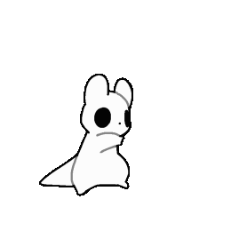

# Marshaw Mod

Here, you control ***a totally normal slugcat like every other modded campaign***.  
and since we're talking about a normal slugcat, it will of course have a sanity bar inspired by Dont Starve.

Of course, I'm from Brazil

# Features so far:

- ``Ascension Code`` - which allows Marshaw to Ascend as a Saint. although I think he's weird for ***this*** slugcat. maybe I'll remove
- ``Pup`` - you are a pup.
- ``Spear Double`` - heavily inspired by an idea I had in the past in Modding Dev, about Spear Dealer. you can get 2 spears
- ``Craft`` *plays Minecraft music* - has Craft table:
>  - ``Rock`` + ``Rock`` = ``Spear``
>  - ``Spear`` + ``Flashbang`` = ``Electric Spear``
>  - ``Spear`` + ``Granade (ScavengerBomb)`` = ``Explosive Spear``

- ``Bro did a flip 💀💀💀💀`` - every time when you do a flip, creats a green light in you. Literally

### Current tests:

- ``Sanity Bar`` - its new for me. I am still working on it

# hmm

nothing else. i have a lot of desnescessary things.

    

enjoy two slugcats dancing above.  
they are cute. you agree.
